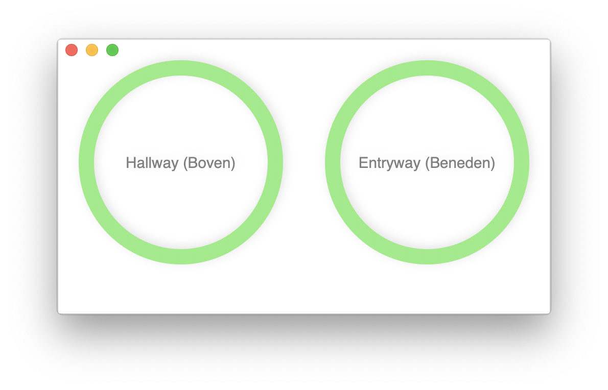

# Nest Protect Status

macOS app that shows color ring status of Nest Protect devices in your Nest account.

This program has been created as a way to explore the Nest API and work with Swift as a developer. It is by no means
a finished app for regular end users.



## Important notice

⚠ The Nest API - which this software is based on - will stop working on [August 31, 2019](https://nest.com/whats-happening/#im-a-works-with-nest-developer-will-my-solution-still-be-able-to-access-and-control-nest-devices):

>As a Works with Nest developer and partner, you will not be able to access or control Nest devices once the Works with Nest APIs are turned off on August 31, 2019. Moving forward, our team will focus on making Works with Google Assistant the most helpful and intelligent ecosystem for the home, enabling all of the products in your users’ homes to work together.
We encourage all smart home developers to visit the Actions on Google Smart Home developer site to learn how to integrate your devices or services with the Google Assistant.

## Use

The program communicates with the Nest API, which requires a OAuth access Key. Read in the Nest API docs [how to generate an access key](https://developers.nest.com/guides/api/how-to-auth).

After you generated an access key, set environment variabele `NEST_ACCESS_KEY` to the value of your access key before running the program.

For convenience, you can set the `NEST_ACCESS_KEY` variable in a `.env` file that will be loaded in to the environment when the program starts. 

Create a file in user home directory: `~/.nest-protect-status.env` in which you set the environment variable:

```
NEST_ACCESS_KEY=XXXXXXXXXXXXXXXX
```

## Credits

- Application icon by [Vectto](https://www.iconfinder.com/icons/2335590/home_home_page_house_profile_icon). License: (CC BY 3.0).
